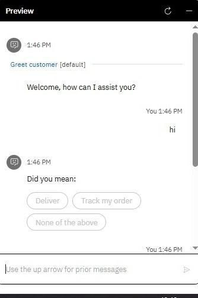
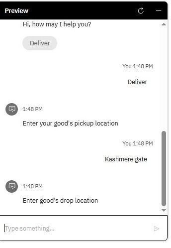
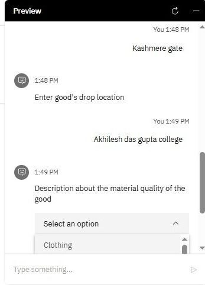
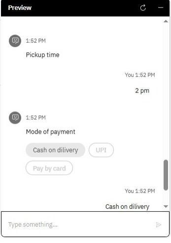
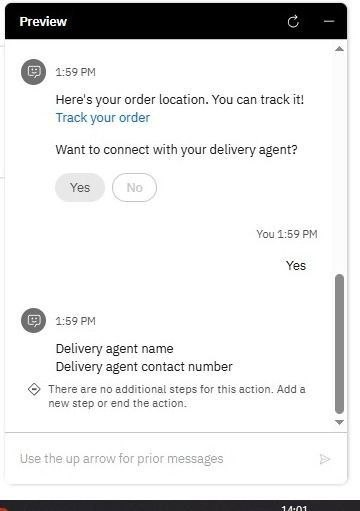
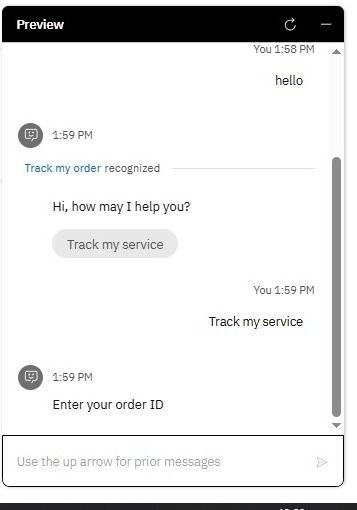

# IBM Watson Assistant Chatbot 🤖

 AI-powered customer support chatbot developed using **IBM Watson Assistant** and **IBM Cloud** during the **IBM Generative AI Summer Training**.

# 📌 Overview

This project demonstrates the development of an AI-powered customer support chatbot for a logistics and delivery platform using IBM Watson Assistant on IBM Cloud.

The chatbot enables users to perform common delivery-related tasks through natural language conversations, including booking deliveries, tracking orders, selecting payment methods, and receiving order confirmations.

The objective of this project was to understand conversational AI, chatbot design, intent-based interactions, and cloud-based AI services.

---

# ✨ Features

- 📦 Delivery Booking
- 🚚 Order Tracking
- 💳 Payment Method Selection
- ✅ Order Confirmation
- 💬 Natural Language Conversation
- ☁️ Cloud-based Deployment using IBM Watson Assistant

---

# 🛠️ Technologies Used

- IBM Watson Assistant
- IBM Cloud
- Conversational AI
- Natural Language Processing (NLP)

---

# 👩‍💻 My Contribution

This project was completed as part of the **IBM Generative AI Summer Training** in a collaborative team environment.

My contributions included:

- Designing the chatbot conversation flow
- Configuring chatbot interactions using IBM Watson Assistant
- Testing chatbot responses for different user scenarios
- Preparing project documentation
- Collaborating with teammates throughout the project

---

# 📄 Project Report

You can view the complete project documentation here:

📄 **[Project Report](Project-Report.pdf)**

---

# 📸 Project Screenshots

## 1️⃣ Welcome Screen

---

## 2️⃣ Delivery Booking

---

## 3️⃣ Pickup & Drop Location

---

## 4️⃣ Payment Method

---

## 5️⃣ Order Confirmation

---

## 6️⃣ Order Tracking

---

# 🎯 Learning Outcomes

Through this project, I gained practical experience with:

- Conversational AI
- IBM Watson Assistant
- IBM Cloud
- Chatbot Design
- Intent-based User Interaction
- AI-powered Customer Support Systems

---

# 📚 Project Information

**Project Type:** IBM Generative AI Summer Training Project

**Domain:** Artificial Intelligence | Conversational AI | Cloud Computing

**Platform:** IBM Watson Assistant on IBM Cloud

---

⭐ If you found this project useful, feel free to explore the repository.
